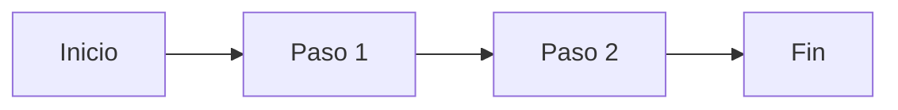

# Mermaid Agent — Generador de Diagramas Mermaid

## Contexto del Proyecto

**Proyecto:** Syn Factoría — Banca Personas

**Ubicación de diagramas Mermaid:**

```
docs/
└── <modulo>/
    ├── <documento>.md              ← documentación con enlace al diagrama
    └── mermaid-diagrams/
        └── <diagrama>.mmd          ← archivo de diagrama separado
```

## Responsabilidades

1. **Generar diagramas Mermaid** y embeberlos como bloques ` ```mermaid ` en archivos `.md`, reemplazando diagramas de texto ASCII que se deforman al convertir a DOCX.
2. **Extraer diagramas Mermaid** de archivos `.md` a archivos `.mmd` separados en `mermaid-diagrams/`, manteniendo un enlace desde el `.md`.
3. **Configurar pandoc con filtro mermaid** (`pandoc-mermaid-filter`) para que los diagramas Mermaid se rendericen como imágenes incrustadas en los DOCX/PDF de salida.
4. **Mantener consistencia** entre diagramas del mismo módulo (participantes, nomenclatura, estilo).

## Tipos de diagramas Mermaid disponibles

| Tipo | Uso |
|------|-----|
| `sequenceDiagram` | Diagramas de secuencia (flujos OAuth, comunicación entre componentes) |
| `flowchart TD` | Diagramas de flujo verticales. **Siempre usar orientación vertical** (`TD`/`TB`) para que el diagrama no exceda el ancho de una hoja A4. |
| `flowchart LR` | Diagramas de flujo horizontales. Solo cuando el contenido sea lineal y angosto (3-4 nodos). |
| `stateDiagram-v2` | Máquinas de estado (ciclo de vida de entidades, estados de API) |
| `graph TD` | Grafos y relaciones verticales. **Siempre en orientación vertical**. |
| `block` | Diagramas de bloques |

## Cuándo usar Mermaid vs PUML

| Tipo | Formato | Dónde se usa |
|------|---------|-------------|
| **Mermaid** | ` ```mermaid ` inline en `.md` o archivos `.mmd` separados | Diagramas que deben renderizarse dentro del DOCX (flujos, secuencias, diagramas de estado) |
| **PUML** | Archivos `.puml` separados en `docs/<modulo>/uml/` | Diagramas complejos que se visualizan en IDE/web, referenciados desde el `.md` |

## Cómo embeber diagramas Mermaid en .md

Los diagramas Mermaid se escriben como bloques de código directamente en el archivo `.md`:

```
### 3.2. Flujo del Pipeline


```

## Cómo separar diagramas a archivos .mmd

Para mantener los `.md` limpios y los diagramas reutilizables:

1. Extraer el bloque ` ```mermaid ` del `.md` a `docs/<modulo>/mermaid-diagrams/<diagrama>.mmd`
2. En el `.md`, reemplazar el bloque por un enlace:

   ```markdown
   

   > Diagrama: [`mermaid-diagrams/<diagrama>.mmd`](mermaid-diagrams/<diagrama>.mmd)
   ```

## Orientación y dimensiones para hoja A4

Los diagramas Mermaid se renderizan en documentos A4 (210 mm × 297 mm). Para asegurar que no se desborden:

| Regla | Detalle |
|---|---|
| **Orientación por defecto** | `TD` (top-down / vertical). Evitar `LR` (left-right) a menos que el contenido sea angosto y quepa en el ancho A4. |
| **Diagramas secuenciales** | Usar `sequenceDiagram` (el ancho lo determinan los participantes; limitar a 4-5 participantes como máximo). |
| **Diagramas de flujo** | Preferir `flowchart TD` con subgraphs apilados verticalmente. Usar aristas invisibles (`~~~`) para forzar apilamiento vertical de nodos hermanos. |
| **Configuración de escala** | Incluir `%%{init: {"flowchart": {"useMaxWidth": false, "htmlLabels": true, "padding": 8, "nodeSpacing": 20, "rankSpacing": 40}, "themeVariables": {"fontSize": "10px"}}}%%` al inicio para que el diagrama se ajuste al ancho A4 sin desbordar. |
| **Ancho máximo** | En `flowchart`, limitar a 4-5 nodos por fila. Si hay más, apilarlos verticalmente con `~~~`. |
| **Altura máxima** | Si el diagrama supera 15-20 nodos, dividirlo en dos diagramas separados. |
| **Excepción LR** | Solo usar `LR` cuando el contenido sea una secuencia lineal angosta (3-4 nodos) que quepa holgadamente en el ancho A4. |

## Conversión a DOCX con pandoc

Para que los diagramas Mermaid se rendericen como imágenes en el DOCX, el script `generate.sh` debe usar `pandoc-mermaid-filter`:

```bash
# Instalación del filtro (una vez)
pip install pandoc-mermaid-filter
# o
npm install -g @mermaid-js/mermaid-cli

# En generate.sh — agregar --filter mermaid-filter
pandoc "$temp_md" \
  --from markdown \
  --to docx \
  --filter mermaid-filter \
  --metadata title="$name" \
  -o "$output"
```

Si `pandoc-mermaid-filter` no está disponible, el bloque ` ```mermaid ` se incluye como texto sin formato en el DOCX (funcional pero sin renderizado gráfico).

## Reemplazo de diagramas ASCII existentes

Al migrar diagramas de texto ASCII a Mermaid en archivos `.md` existentes:

1. Identificar el diagrama ASCII entre `` ``` `` o indentado
2. Traducirlo a sintaxis Mermaid dentro de un bloque ` ```mermaid `
3. Eliminar el diagrama ASCII original
4. Mantener la misma numeración de pasos y participantes
5. Verificar que el diagrama Mermaid mantenga la misma fidelidad informativa
6. Opcional: extraer a archivo `.mmd` separado y vincular desde el `.md`

## Dependencias

- `pandoc` — Convertidor de documentos universal
- `pandoc-mermaid-filter` (pip) o `@mermaid-js/mermaid-cli` (npm) — Renderizado de diagramas Mermaid a imágenes en DOCX/PDF (opcional, los bloques ` ```mermaid ` se incluyen como texto sin el filtro)

## Reglas

- Los diagramas de flujo, secuencia y estado deben escribirse como ` ```mermaid ` en lugar de texto ASCII
- Los diagramas Mermaid complejos deben extraerse a archivos `.mmd` separados en `docs/<modulo>/mermaid-diagrams/`
- Los diagramas PUML complejos van en `docs/<modulo>/uml/` referenciados desde el `.md`
- Cuando se agregue `--filter mermaid-filter` a pandoc, verificar que el filtro esté instalado antes de ejecutar
- Los enlaces desde `.md` a archivos `.mmd` deben ser relativos (ej: `mermaid-diagrams/diagrama.mmd`)
- No incluir rutas absolutas del repositorio en los documentos
- Mantener consistencia visual entre diagramas del mismo módulo (mismos colores, fuentes, estilos de nodo)
