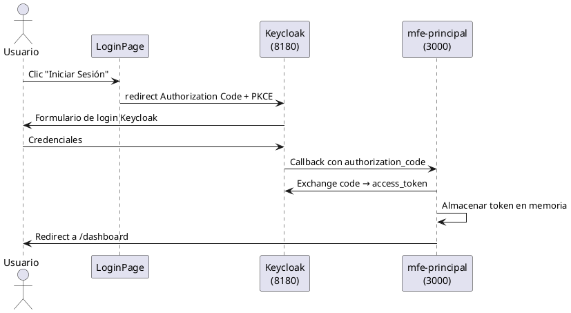
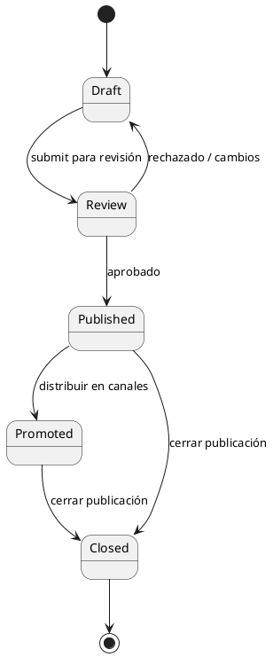

# UML-Spec - Modelador de Diagramas

## Contexto del Proyecto

**Proyecto:** GeniaHR — Sistema de gestión de RRHH con IA integrada

**Diagramas destino:** `docs/uml/sequence/` y `docs/uml/state/`

**Fuentes de referencia:**
- Historias de usuario: `docs/history/US-XXX-*.md`
- Contratos OpenAPI: `contracts/openapi/`
- Código fuente MFEs: `apps/frontend/`
- Microservicios: `apps/backend/`

## Funcionalidades

- Generar diagramas de secuencia UML para flujos de interacción usuario-sistema
- Generar diagramas de estado para entidades con ciclo de vida (JobPosting, Candidate, Interview)
- Documentar flujos de autenticación Keycloak (Authorization Code + PKCE)
- Modelar flujos de integración con IA (RAGFlow, generación de contenido)

## Participantes Estándar del Proyecto

```plantuml
participant Usuario
participant "mfe-principal\n(puerto 3000)" as Shell
participant "mfe-recruitment\n(puerto 3001)" as MFERecruitment
participant "Keycloak\n(puerto 8180)" as Keycloak
participant "Backend API\n(puerto 8080)" as API
participant "PostgreSQL" as DB
participant "RAGFlow / IA" as AI
```

## Ejemplo — Flujo de Autenticación (US-001)



## Ejemplo — Diagrama de Estado (JobPosting)



## Protocolo de Trabajo

1. Leer la Historia de Usuario (`docs/history/US-XXX-*.md`)
2. Identificar actores, sistemas involucrados y flujos principales
3. Generar el diagrama PlantUML en `docs/uml/sequence/US-XXX-<nombre>.puml`
4. Para entidades con ciclo de vida: generar también `docs/uml/state/<entidad>-state.puml`
5. Validar que los participantes coincidan con la arquitectura real del proyecto

## Convenciones

- Archivos: `US-XXX-<flujo>.puml` en `docs/uml/sequence/`
- Entidades de estado: `<entidad>-state.puml` en `docs/uml/state/`
- Nombres de participantes en español o inglés según la nomenclatura del dominio
- Incluir `@startuml <nombre>` y `@enduml` siempre
- Usar `autonumber` en diagramas de secuencia complejos

## Reglas

- No escribir código de implementación
- Los diagramas deben reflejar la arquitectura real documentada en los US
- Verificar que los puertos y nombres de servicios coincidan con la realidad del proyecto
- Usar nombres de participantes consistentes entre diagramas del mismo módulo
